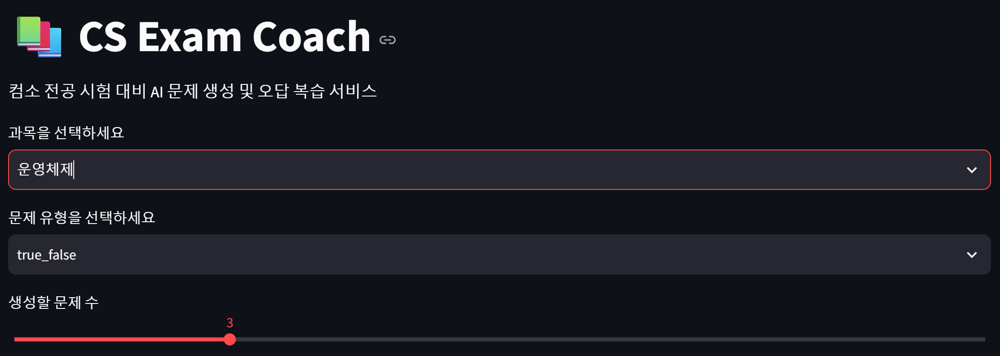
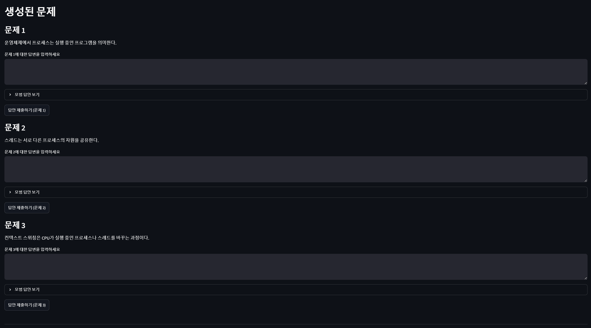
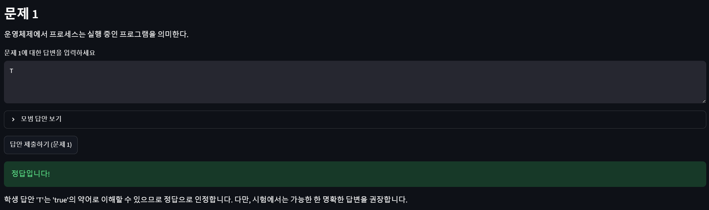

# CS Exam Coach

컴소 전공 시험 대비를 위한 AI 문제 생성 및 오답 복습 서비스입니다.

현재 버전: v2.3
주요 업데이트: 문서별 RAG 질의응답 기능

## 1. 프로젝트 개요

CS Exam Coach는 사용자가 전공 공부 내용을 입력하면 AI가 시험 대비 문제를 생성하고, 사용자의 답안을 채점한 뒤, 오답 개념을 저장하여 복습 우선순위를 추천합니다.

## 2. 개발 동기

기존 AI 학습 도구는 강의자료 요약에는 강하지만, 컴퓨터공학 전공 시험에서 자주 나오는 코드 추적형, SQL 작성형, 개념 비교형 문제 생성에는 특화되어 있지 않습니다. 이 프로젝트는 컴소 전공생의 시험 대비 과정에 맞춘 AI 학습 코치를 목표로 합니다.

## 3. 주요 기능

- 과목별 공부 내용 입력
- AI 기반 예상문제 생성
- 객관식/단답형/서술형/코드추적형 등 문제 지원
- 사용자 답안 채점
- 오답 개념 저장
- 오답 빈도 기반 복습 추천
- Streamlit 기반 웹 UI
- Docker Compose 기반 실행 환경 구성
- 최근 생성 문제 조회
- 최근 오답 기록 조회
- 학습 기록 기반 복습 관리
- 문제 난이도 선택
- PDF 강의자료 업로드
- PDF 텍스트 추출
- 추출된 PDF 내용 기반 문제 생성
- 사용자 이름 기반 학습 기록 분리
- 사용자별 오답 저장
- 사용자별 복습 추천
- 사용자별 학습 기록 조회
- 시험 D-Day 기반 복습 계획 생성
- 사용자별 오답 개념을 바탕으로 복습 일정 추천
- PDF 페이지 범위 선택
- 선택한 페이지 범위 기반 텍스트 추출
- 시험 범위 PDF 페이지만 선택하여 문제 생성
- 문제별 품질 평가
- 해설 품질 평가
- 시험 적합도 평가
- 난이도 적절성 평가
- 사용자별 문제 평가 요약 조회
- 관리자용 문제 품질 대시보드
- 전체 평가 평균 조회
- 낮은 품질 문제 목록 조회
- 시험 적합도 낮은 문제 목록 조회
- 최근 사용자 평가 코멘트 조회
- RAG 기반 문서 질의응답
- PDF 텍스트 chunk 분할
- OpenAI Embedding 기반 벡터 검색
- Chroma vector DB 저장
- 문서 근거 기반 답변 생성
- 참고한 문서 chunk 출처 표시
- RAG 답변 source에 PDF 페이지 번호 표시
- 페이지 단위 chunk metadata 저장
- 선택한 PDF 페이지 범위 기반 RAG 인덱싱
- RAG 인덱싱 문서 목록 조회
- 사용자별/과목별 RAG 문서 필터링
- 문서별 chunk 수 및 page 목록 확인
- material_id 기준 RAG 인덱싱 문서 삭제
- 문서별 RAG 질의응답
- 과목 전체 문서 검색과 특정 PDF 문서 검색 선택
- material_id 기준 검색 범위 제한

## 4. 제한사항

- 현재 PDF 업로드 기능은 텍스트 기반 PDF를 대상으로 합니다.
- 스캔본 PDF는 OCR을 지원하지 않아 텍스트 추출이 제한될 수 있습니다.
- 긴 PDF는 AI API 입력 길이 제한으로 인해 일부 내용만 사용하는 방식으로 개선할 예정입니다.
- 현재 사용자 구분은 로그인 방식이 아니라 사용자 이름 입력 방식으로 동작합니다.
- 동일한 사용자 이름을 입력하면 같은 학습 기록을 조회할 수 있습니다.
- 실제 서비스에서는 회원가입/로그인 및 인증 기능이 필요합니다.
- 시험 복습 계획은 오답 빈도를 기준으로 한 규칙 기반 추천이며, 실제 학습 효과를 보장하지 않습니다.
- 페이지 범위는 사용자가 직접 입력해야 합니다.
- 현재 관리자 대시보드는 별도 인증 없이 접근 가능합니다.
- 실제 서비스에서는 관리자 인증 및 권한 분리가 필요합니다.
- 현재 RAG는 텍스트 추출 가능한 PDF만 지원합니다.
- 현재 source는 PDF 페이지 번호와 chunk 번호를 기준으로 표시됩니다.
- PDF 텍스트 추출 품질에 따라 page metadata 정확도가 달라질 수 있습니다.
- 스캔본 PDF는 OCR을 지원하지 않아 페이지 기반 RAG 품질이 제한될 수 있습니다.
- RAG 문서 삭제는 Chroma Vector DB의 chunk만 삭제합니다.
- PostgreSQL의 StudyMaterial 기록은 유지됩니다.
- 현재 문서 삭제는 사용자 이름, 과목, material_id 기준으로 동작합니다.
- 특정 문서 검색은 material_id 기준으로 동작합니다.
- 현재 여러 material_id를 동시에 선택하는 기능은 지원하지 않습니다.

## 5. 기술 스택

### Frontend
- Streamlit
- Requests

### Backend
- FastAPI
- Pydantic
- SQLAlchemy

### Database
- PostgreSQL

### AI
- OpenAI API

### Infra
- Docker
- Docker Compose

### RAG / Vector Search
- Chroma
- OpenAI Embeddings
- Vector Similarity Search

## 6. 시스템 구조

사용자는 Streamlit 화면에서 공부 내용을 입력합니다.  
Frontend는 FastAPI 서버에 문제 생성을 요청합니다.  
FastAPI는 AI API를 호출해 문제와 정답, 해설, 개념 태그를 생성합니다.  
생성된 문제와 사용자의 오답 기록은 PostgreSQL에 저장됩니다.  
복습 추천 API는 오답 개념 빈도를 집계하여 우선 복습할 개념을 반환합니다.

```text
User
 ↓
Streamlit Frontend
 ↓
FastAPI Backend
 ↓
PostgreSQL

FastAPI Backend
 ↓
OpenAI API
```

## 7. 주요 API

### 1. 문제 생성 API

`POST /questions/generate`

#### Query Parameters

| 이름 | 설명 |
|---|---|
| user_name | 사용자 이름 |

#### Request

```json
{
  "subject": "운영체제",
  "content": "프로세스는 실행 중인 프로그램이다...",
  "question_type": "short_answer",
  "count": 5
}
```

#### Response

```json
{
  "material_id": 1,
  "questions": [
    {
      "id": 1,
      "question_text": "프로세스와 스레드의 차이를 설명하시오.",
      "answer": "프로세스는 독립된 실행 단위이고, 스레드는 프로세스 내부의 실행 단위이다.",
      "explanation": "스레드는 같은 프로세스의 메모리 공간을 공유한다.",
      "concept_tag": "프로세스와 스레드",
      "question_type": "short_answer"
    }
  ]
}
```

### 2. 채점 API

`POST /grading/grade`

#### Query Parameters

| 이름 | 설명 |
|---|---|
| user_name | 사용자 이름 |

#### Request

```json
{
  "question_id": 1,
  "question_text": "프로세스와 스레드의 차이를 설명하시오.",
  "correct_answer": "프로세스는 독립된 실행 단위이고, 스레드는 프로세스 내부의 실행 단위이다.",
  "user_answer": "프로세스와 스레드는 같은 개념이다.",
  "concept_tag": "프로세스와 스레드"
}
```

#### Response

```json
{
  "is_correct": false,
  "feedback": "프로세스와 스레드를 같은 개념으로 설명한 점이 틀렸습니다. 스레드는 프로세스 내부에서 실행되며 자원을 공유합니다.",
  "concept_tag": "프로세스와 스레드"
}
```

### 3. 복습 추천 API

`GET /review/recommendations`

#### Query Parameters

| 이름 | 설명 |
|---|---|
| user_name | 사용자 이름 |

#### Response

```json
[
  {
    "concept_tag": "프로세스와 스레드",
    "wrong_count": 3,
    "recommendation": "프로세스와 스레드 개념을 우선 복습하세요."
  }
]
```

### 4. 최근 생성 문제 조회 API

`GET /history/questions`

#### Query Parameters

| 이름 | 설명 |
|---|---|
| user_name | 사용자 이름 |

#### Response

```json
[
  {
    "id": 12,
    "material_id": 3,
    "question_text": "프로세스와 스레드의 차이를 설명하시오.",
    "answer": "프로세스는 독립된 실행 단위이고, 스레드는 프로세스 내부의 실행 단위이다.",
    "explanation": "같은 프로세스의 스레드는 메모리 공간과 자원을 공유한다.",
    "concept_tag": "프로세스와 스레드",
    "question_type": "short_answer",
    "created_at": "2026-07-30T17:45:12.123456"
  }
]
```

### 5. 최근 오답 기록 조회 API

`GET /history/wrong-answers`

#### Query Parameters

| 이름 | 설명 |
|---|---|
| user_name | 사용자 이름 |

#### Response

```json
[
  {
    "id": 8,
    "question_id": 12,
    "user_answer": "프로세스와 스레드는 같은 개념이다.",
    "correct_answer": "프로세스는 독립된 실행 단위이고, 스레드는 프로세스 내부의 실행 단위이다.",
    "concept_tag": "프로세스와 스레드",
    "feedback": "스레드는 프로세스 내부에서 실행되며 같은 프로세스의 자원을 공유합니다.",
    "is_correct": false,
    "created_at": "2026-07-30T17:48:31.654321"
  }
]
```

### 6. PDF 텍스트 추출 API

`POST /materials/extract-pdf`

#### Request

Form Data:

| 이름 | 설명 |
|---|---|
| user_name | 사용자 이름 |
| subject | 과목명 |
| start_page | 시작 페이지 |
| end_page | 끝 페이지 |
| file | PDF 파일 |

#### Response

```json
{
  "success": true,
  "user_name": "user_a",
  "material_id": 1,
  "subject": "운영체제",
  "filename": "os_chapter1.pdf",
  "page_count": 20,
  "selected_start_page": 3,
  "selected_end_page": 7,
  "selected_page_count": 5,
  "text_length": 8432,
  "preview": "운영체제란...",
  "content": "전체 추출 텍스트"
}
```

### 7. 시험 D-Day 복습 계획 API

`GET /review/study-plan`

#### Query Parameters

| 이름 | 설명 |
|---|---|
| user_name | 사용자 이름 |
| exam_date | 시험 날짜, YYYY-MM-DD 형식 |

#### Response

```json
{
  "success": true,
  "user_name": "user_a",
  "exam_date": "2026-08-15",
  "days_left": 14,
  "weak_concepts": [
    {
      "concept_tag": "프로세스와 스레드",
      "wrong_count": 3
    }
  ],
  "plan": [
    {
      "day": "D-14 ~ D-8",
      "task": "오답 빈도가 높은 개념부터 차근차근 복습하고, 관련 개념을 다시 정리하세요.",
      "concepts": ["프로세스와 스레드"]
    }
  ]
}
```

### 8. 문제 평가 저장 API

`POST /feedback/question`

#### Request

```json
{
  "user_name": "user_a",
  "question_id": 1,
  "quality_score": 5,
  "explanation_score": 4,
  "exam_relevance_score": 5,
  "difficulty_match_score": 4,
  "comment": "시험 대비에 도움이 되는 문제였습니다."
}
```

#### Response

```json
{
  "success": true,
  "message": "문제 평가가 저장되었습니다.",
  "feedback_id": 1
}
```

### 9. 문제 평가 요약 API

#### Query Parameters

| 이름 | 설명 |
|---|---|
| user_name | 사용자 이름 |

#### Response

```json
{
  "feedback_count": 3,
  "avg_quality_score": 4.67,
  "avg_explanation_score": 4.33,
  "avg_exam_relevance_score": 4.67,
  "avg_difficulty_match_score": 4.0
}
```

### 10. 관리자용 평가 대시보드 API

`GET /feedback/admin-dashboard`

#### Response

```json
{
  "feedback_count": 10,
  "summary": {
    "avg_quality_score": 4.1,
    "avg_explanation_score": 4.0,
    "avg_exam_relevance_score": 3.8,
    "avg_difficulty_match_score": 4.2
  },
  "low_score_questions": [],
  "low_exam_relevance_questions": [],
  "recent_comments": []
}
```

### 11. RAG 문서 인덱싱 API

`POST /rag/index`

#### Request

```json
{
  "user_name": "user_a",
  "subject": "운영체제",
  "material_id": 1,
  "content": "운영체제 강의자료 텍스트..."
}
```

#### Response

```json
{
  "success": true,
  "message": "문서 인덱싱이 완료되었습니다.",
  "chunk_count": 8,
  "material_id": 1
}
```

### 12. RAG 문서 질의응답 API

`POST /rag/ask`

#### Request

```json
{
  "user_name": "user_a",
  "subject": "운영체제",
  "question": "프로세스와 스레드의 차이는?",
  "top_k": 5,
  "material_id": 1
}
```

#### Response

```json
{
  "success": true,
  "search_scope": "material_id=1 문서",
  "material_id": 1,
  "answer": "프로세스는...",
  "sources": [
    {
      "source_number": 1,
      "material_id": 1,
      "page_number": 12,
      "chunk_index": 0,
      "distance": 0.23,
      "preview": "프로세스는 실행 중인 프로그램..."
    }
  ]
}
```

### 13. RAG 문서 목록 조회 API

`GET /rag/documents`

#### Query Parameters

| 이름 | 설명 |
|---|---|
| user_name | 사용자 이름 |
| subject | 과목명, 선택 |

#### Response

```json
{
  "success": true,
  "document_count": 1,
  "documents": [
    {
      "user_name": "user_a",
      "subject": "운영체제",
      "material_id": 1,
      "chunk_count": 8,
      "pages": [2, 3, 4],
      "page_count": 3
    }
  ]
}
```

### 14. RAG 문서 삭제 API

`DELETE /rag/documents`

#### Request

```json
{
  "user_name": "user_a",
  "subject": "운영체제",
  "material_id": 1
}
```

#### Response

```json
{
  "success": true,
  "message": "인덱싱 문서가 삭제되었습니다.",
  "deleted_count": 8,
  "material_id": 1
}
```

## 8. 실행 방법

### 1. 환경 변수 설정

`backend/.env` 파일을 생성합니다.

```env
DATABASE_URL=postgresql://postgres:postgres@db:5432/cs_exam_coach
OPENAI_API_KEY=your_openai_api_key
```

### 2. Docker Compose 실행

```bash
docker compose up --build
```

### 3. 접속 주소

```text
Frontend: http://localhost:8501
Backend API Docs: http://localhost:8000/docs
```

## 9. 시연 흐름

1. 과목을 선택합니다.
2. 공부 내용을 입력합니다.
3. 문제 유형과 문제 개수를 선택합니다.
4. AI가 시험 대비 문제를 생성합니다.
5. 사용자가 답안을 입력합니다.
6. AI가 답안을 채점하고 피드백을 제공합니다.
7. 오답 개념이 저장됩니다.
8. 복습 추천 화면에서 많이 틀린 개념을 확인합니다.

## 10. 시연 화면

### 메인 화면



### 문제 생성



### 채점 결과



### 복습 추천


## 11. 향후 개선 사항

* PDF 업로드 기능
* RAG 기반 강의자료 질의응답
* 로그인 및 사용자별 학습 기록
* 과목별 학습 통계
* 시험 D-Day 기반 복습 계획
* 문제 난이도 자동 조절
* 스터디 그룹 공유 기능
* AWS EC2 배포
